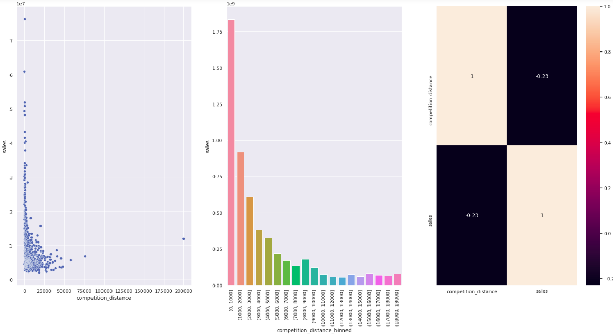
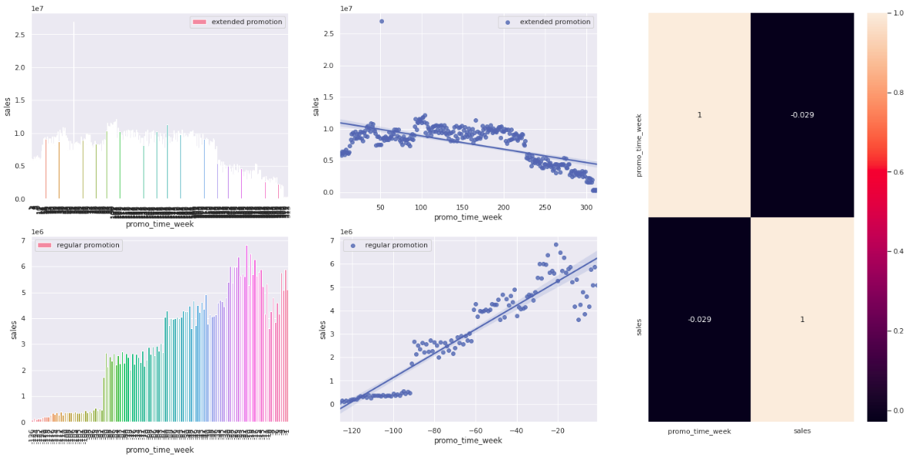
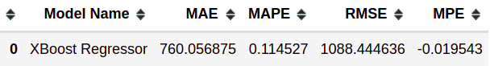

# P003-Sales-Forecast-Drugstores

  

This repository contains an end-to-end project for forecasting drugstore sales applying linear and non-linear regression. 

## P003 - Machine Learning Project on Regression for Drugstore Sales Forecasting

The aim of this project is:
* Perform a forecasting drugstore sales for the next six weeks
* Get an overview of the dataset and handle null values
* Create a mind map hypothesis to determine which one is true
* Determine which variables are most relevant
* Apply transformations on features to behave close to a normal distribution
* Apply Boruta as a feature selector
* Apply Linear and Non-linear algorithms to understand the model complexity.
* Compare algorithms for machine learning modeling considering: Average, Linear Regression, Linear Regression Regularized (Lasso), Random Forest Regressor, and XGBoost Regressor
* Apply hyperparameter fine tunning using random search
* Perform error interpretation considering business and machine learning performance
* Deploy model to production on telegram

---
## 1. Business Problem

Drugstore managers request sales forecasts for the next six weeks. 

Looking for the root cause, the data scientist spoke with the CFO to get more details about the request. 

The CFO explained need to determine the budget to perform a repair on the drugstores. 

The CFO wants to know the sales forecasting to determine the percentage of money that can use by each drugstore to perform the repairs. 

## 2. Business Results

The solution aims to create a machine learning model that uses the drugstores' characteristics to forecast sales in a future period. 

Information about the drugstore sales forecasting is shown on a Telegram Bot. 

## 3. Business Assumptions

* Only days when drugstores were open were considered.
* Only drugstores with sales values bigger than 0 were considered.
* The day, month, year, and week information were based on the date.
*  For drugstores that did not have the Competition Distance information, it was considered should have a distance equal as 200000.
* For drugstores that did not have promo since and promo_time_week information considered the date as the initial parameter.
* For drugstores that did not have CompetitionOpenSince [month/year] information considered the date as the initial parameter.

 

* The variables on the dataset are: 

|Variable | Definition|
|-------- | -------------|
|Assortment| describes an assortment level: a = basic, b = extra, c = extended |
|CompetitionDistance| distance in meters to the nearest competitor store|
|CompetitionOpenSince[month/year]| gives the approximate year and month of the time the nearest competitor was opened |
|Customers | the number of customers on a given day |
|Date| represents the date the drugstore information began to be collected |
|Id | represents a (Store, Date) duple within the test set |
|Is_promo | indicates whether a store is running a promo on that month |
|Open | an indicator for whether the store was open: 0 = closed, 1 = open |
|Promo | indicates whether a store is running a promo on that day |
|Promo2 | is a continuing and consecutive promotion for some stores: 0 = store is not participating, 1 = store is participating |
|Promo2Since[year/week] | describes the year and calendar week when the store started participating in Promo2 |
|PromoInterval | describes the consecutive intervals Promo2 is started, naming the months the promotion is started anew. E.g. "Feb,May,Aug,Nov" means each round starts in February, May, August, November of any given year for that store |
|Sales | the turnover for any given day |
|SchoolHoliday | indicates if the (Store, Date) was affected by the closure of public schools|
|StateHoliday | indicates a state holiday. Normally all stores, with few exceptions, are closed on state holidays. Note that all schools are closed on public holidays and weekends. a = public holiday, b = Easter holiday, c = Christmas, 0 = None|
|Store | a unique Id for each store |
|StoreType | differentiates between 4 different store models: a, b, c, d| 

## 4. Solution Strategy

My strategy to solve this challenge was applying CRISP-DM methodology considering the following steps: 
-**Step 01. Data Description:** Get an overview of the dataset, handle null values, and get descriptive statistics for the numeric and categorical attributes. 
-**Step 02. Feature Engineering:** Create a mind map hypothesis to determine which one is true and create new features 
-**Step 03. Data Cleaning:** Filter variables ​​considering business bias based on data constraints. 
-**Step 04. Exploratory Data Analysis:** Determine which ​​variables are most relevant through applying univariate, bivariate, and multivariate analysis. In addition, analyze the veracity of the hypotheses. 
-**Step 05. Data Preparation:** Apply RobustScaler and MinMaxScaler rescaling methods on the features competition_distance, competition_time_month, promo_time_week, and year. Apply encoding transformation on the features store_type, assortment, and state_holiday. Apply cyclical transformation on the features day_of_week, month, day, and week_of_year. 
-**Step 06. Feature Selection:** Split the dataset into the train and the test, filter the variables considering the correlation with the response variable and apply Boruta as a feature selector. 
-**Step 07. Machine Learning Modeling:** compare machine learning modeling performance considering a baseline (Average), two linear (Linear Regression and Regularized Linear Regression - Lasso), and two non-linear (Random Forest Regressor and XGBoost Regressor). Implementation of cross-validation to compare models with their real performance and ranking based on the less RMSE error. 
-**Step 08. Hyperparameter Fine Tunning:** apply the random search optimization method to find a good solution quickly based on a search space that contains the parameters with values ​​within a range. 
-**Step 09. Translation and Error interpretation:** Error analysis based on business performance to create scenarios ( best and worst scenarios ) and Machine learning model performance analysis (error rate and residue analysis). 
-**Step 10. Deploy to Production:** create a class named "Rossmann.py" containing the data preparation and feature engineering. Create an API named "Handler" using Flask to communicate the Rossmann class with the trained model to get the sales forecast based on a "Rossmann API" request. Create an API named "Rossmann API" using Flask to communicate the "Handler" API with the test dataset and also with the telegram application containing a Telegram Bot. 
-**Step 11. Telegram Bot:** Deploy API "Handler" and "Rossmann API" on Heroku cloud. Create a Telegram Bot that receives the drugstore sales forecasting after a user sends a message containing the drugstore number.
  

## 5. Top Data Insights

### H2. Stores with closer competitors should sell less.
### FALSE Stores with CLOSER COMPETITORS sell MORE.

According to common sense, the closer the drugstores are to the competitors, the lower sales will be, but this hypothesis proves that this is not true.
The analysis of the scatter chart and bar chart shows the sales concentration occurs when competitors are closer.
The correlation analysis of "competition distance" and "sales" shows a small correlation, indicating that sales do not increase when competitors are closer together.

### H3. Stores with longer-term competitors should sell more.
### FALSE Stores with LONG-TERM COMPETITORS sell LESS

According to common sense, older drugstores should sell more, but when analyzing 10 years it is clear that this is not true.
The analysis on the second graph shows a variation in sales over the month with a decreasing tendency over the years.
The correlation analysis of "competition time month" and "sales" shows a small correlation, indicating that sales do not increase when competitors with longer-term competitors.

### H4. Stores with promotions active for longer should sell more.
### FALSE Stores with PROMOTIONS ACTIVE FOR LONGER sell LESS after a promotion period.

According to common sense, the more days with promotions, the more sales the stores will have, but when we compare regular and extended promotions, it is clear that there is a drop in sales in extended promotions.
On the first line of the graphics, you can see the comparison between extended promotion and sales.
On the second line of the graphics, you can see the comparison between regular promotion and sales.
The correlation analysis of "promotion time week" and "sales" shows a small correlation, indicating that sales do not increase with promotions active for longer.

 

## 6. Machine Learning Models Applied and Performance

The following machine learning models were trained:

Average model (baseline);
Linear Regression;
Linear Regression Regularized - LASSO;
Random Forest Regressor;
XGBoost Regressor.

All the models applied went through the Cross Validation stage to verify the real performance.

  

## 7. Machine Learning Performance after Hyperparemeter Fine Tuning

Due to server space, I decided to choose XGBoost instead of Random Forest.  

So, after choosing the final model, it was submitted to the fine-tuning phase resulting in a good performance.  

 

## 8. Model performance vs Business values

MAE, also named as L1 loss function, is a type of error that indicates how much an error can raise or lower the forecast values. The XGBoost regression model reduced the MAE error to 760.06, which represents 46.84% efficiency.

  

Based on the predictions, we can create some scenarios (best and worst) and analyze the variation between them.

  

## 9. How to access and get the prediction  
### **Pre-requirement**

- Sign up on Telegram and create an account

### **Telegram**
- Click on the icon below to access the sales forecasting  

### **Prediction In Real Time**

- Submit one number at a time to receive the drugstore sales forecast based on the next six weeks.

   

 - Two types of errors can occur: "Store not available" occurs when the drug store number is not in the test dataset, and "Store ID is wrong" occurs when submitting something other than a number.

    

## 10. Conclusion  

The results indicate that the application of Machine Learning models helps in the analysis of scenarios.

The first CRISP cycle showed satisfactory results and can be presented for evaluation by the company's CFO.
 

## 11. Next Steps to improve

- Analyse the variables again and test creating new options or improving the relationships that already exist.
- Test the veracity of others business hypothesis.
- Implement other types of encodings.
- Implement other types of transformation.
- Implement bayesian search hyperparameter.
- Enhance TelegramBot to provide more detailed information.
 

----
**References:**

* Comunidade [DS](https://www.comunidadedatascience.com/)
* Dataset from [Kaggle](https://www.kaggle.com/c/rossmann-store-sales)
* Image available free on [Shutter Stock](https://www.shutterstock.com//)
